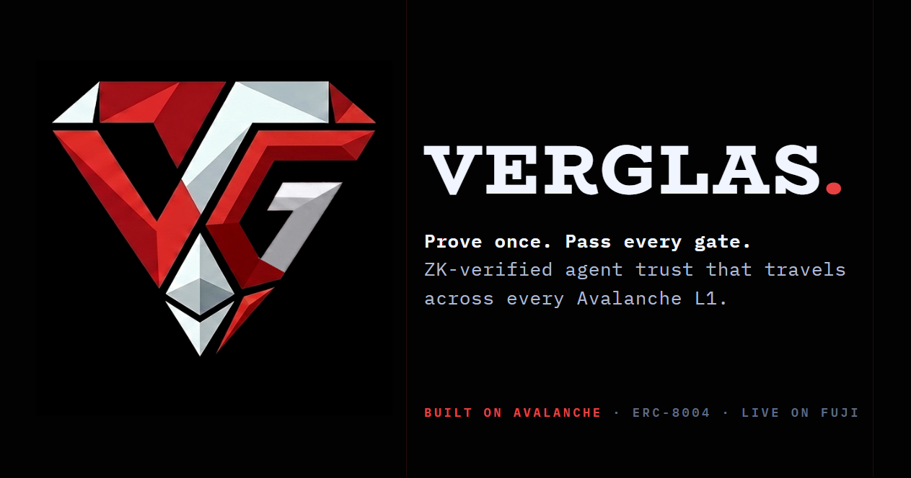
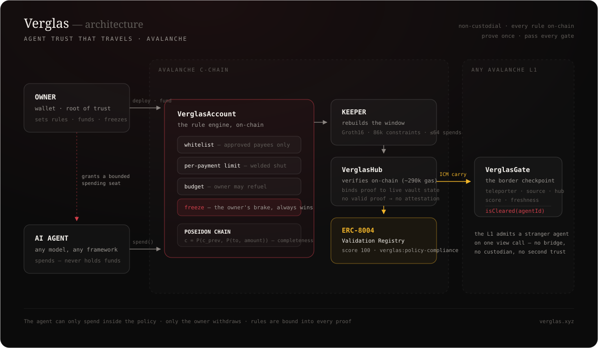
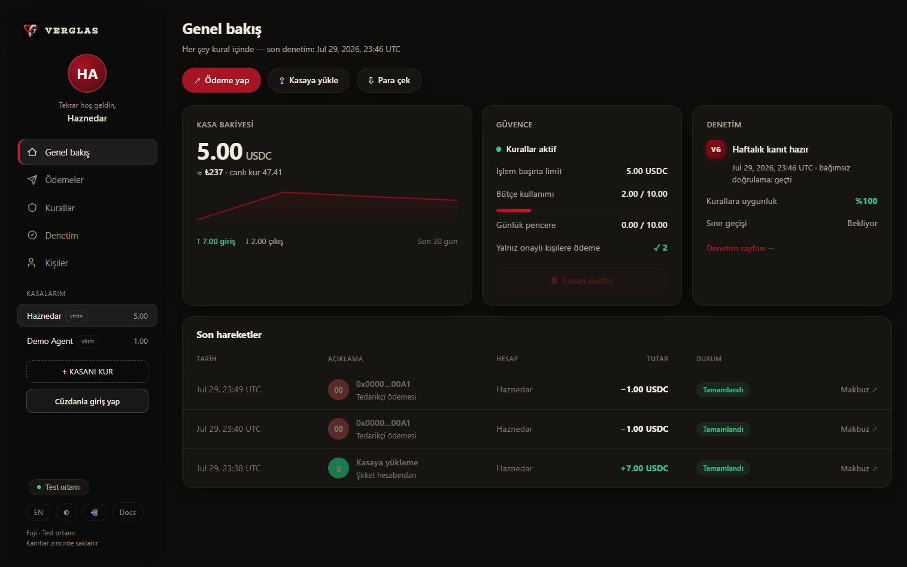
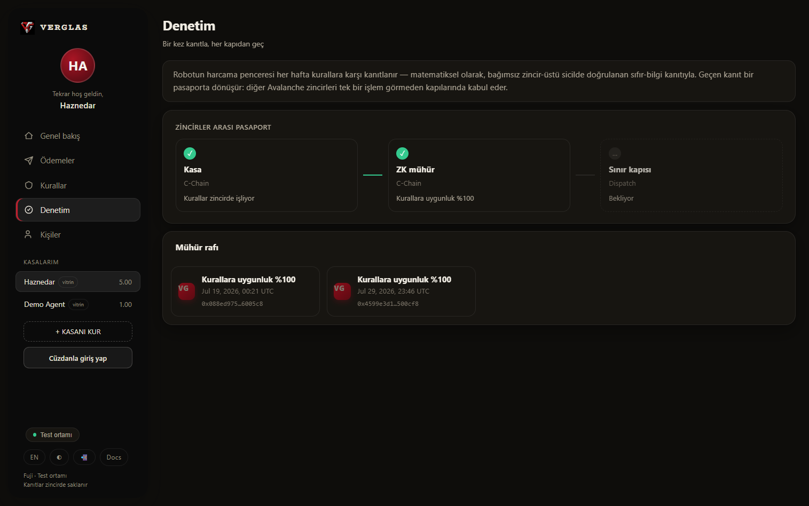

<div align="center">


# Verglas

### Agent trust that travels.

*Prove once. Pass every gate.*

[](https://github.com/Bekirerdem/verglas/actions/workflows/test.yml)


**[verglas.xyz](https://verglas.xyz)** · **[Open the console →](https://verglas.xyz/app)** · **[Agent record](https://verglas.xyz/check/219)** · **[Docs](https://verglas.xyz/docs)**



</div>

---

> *verglas (n.) — a thin, clear, hard coating of ice. Clear as glass, hard as ice.*

Avalanche is not one chain; it is a federation of sovereign L1s. An agent that earns trust on
one chain arrives as a stranger on every other. Verglas gives an AI agent a **rule-bound,
non-custodial vault**, proves its spending obeyed the owner's policy with a **zero-knowledge
proof**, records the result as an **ERC-8004 validation attestation**, and carries that
attestation across the federation over **ICM** — so trust earned once is honored everywhere.

*Spend limits are commodity. The proof is the product.*

## Live on Avalanche mainnet

Not a demo. Real Circle USDC, real agent identities on the canonical ERC-8004 registry, real
proofs verified on-chain.

| | |
|---|---|
| **Hub** | [`0x2b6466EC…169C`](https://snowtrace.io/address/0x2b6466EC93C064f67C260c30613593460252169C) |
| **Validation Registry** | [`0x332fc886…4a01`](https://snowtrace.io/address/0x332fc886dd6ab933c89a1149e7D938a6B4214a01) |
| **Groth16 verifier** | [`0xa2497287…a24C`](https://snowtrace.io/address/0xa24972871B987cC7feD401Ea8e46F6D85F88a24C) |
| **Oracle** | [`0x31900CA6…1239`](https://snowtrace.io/address/0x31900CA6bBd05ac2516feB6798f6aeB86FD41239) |
| **Factory** | [`0x7eC0c53f…D758`](https://snowtrace.io/address/0x7eC0c53fC6C865c1865aef6c744f5b9B1b7CD758) (daily-limit vaults, 2026-08-13; [previous generation](https://snowtrace.io/address/0xc07ef259Eb88742e00113d9F460F5D2081078960) stays readable) |
| **Identity** | canonical ERC-8004 [`0x8004A169…a432`](https://snowtrace.io/address/0x8004A169FB4a3325136EB29fA0ceB6D2e539a432) |

Two vaults, two agents, six real payments, two proofs — every one of them checkable:

- **Agent #1783** — 2 payments, proof verified in [tx `0x3419e9d3…`](https://snowtrace.io/tx/0x3419e9d3a8dda0ba3b83a59a9131bc50c17b798098516bc508611ccf2996528a) (621k gas), score 100.
- **Agent #1784** — a three-payee whitelist, **4 payments to two different people**, budget
  spent to exhaustion, the whole window proven in
  [tx `0x0f29a119…`](https://snowtrace.io/tx/0x0f29a119b285892afca74792e229c3dd4d5b6cbda555c0ad07342db871e2a1e6) (628k gas), score 100.

Full ledger — including the Fuji testnet deployment and its cross-chain gate — in
[`deployments/fuji-testnet.md`](deployments/fuji-testnet.md).

## How it works

<div align="center">

</div>

1. **Vault** — the owner deploys a `VerglasAccount` with hard rules: per-payment limit,
   rolling 24h daily cap, lifetime budget, payee whitelist, kill-switch. The agent spends
   inside them and cannot renegotiate. Structure (whitelist, per-payment limit) is welded
   shut at birth because every proof is bound to it; the budget is fuel the owner can top
   up, and the daily cap rides the public counters — no circuit change needed.
2. **Receipt** — every spend is folded into an on-chain Poseidon hash chain,
   `c = P(c_prev, P(to, amount))`. A hash *chain*, not a Merkle tree: the claim is
   completeness ("all of these"), which a membership proof cannot make.
3. **Proof** — the keeper rebuilds the spend window and produces one Groth16 proof
   (~86k constraints) for up to 64 payments: *every spend went to an approved payee, under
   the limit.*
4. **Passport** — `VerglasHub` binds the proof's public inputs to live vault state, verifies
   on-chain, and writes an ERC-8004 validation response. It cannot vouch for anyone by
   choice: no valid proof, no attestation.
5. **Gate** — any Avalanche L1 runs a `VerglasGate` (ICM receiver) and answers
   `isCleared(agentId)` in one call — **prove once, pass every gate.**

## The console



*The live mainnet vault — agent #1783, real USDC.* Business language on the surface,
contracts underneath: the balance with its live FX reading, the rules in plain words with a
two-step brake, and an audit card that turns a Groth16 proof into "weekly proof ready ·
independent verification passed".



*The audit page, on Fuji.* It shows the leg mainnet does not have yet: vault → ZK seal →
**border gate on a second L1**. Cross-chain clearance is M3, deployed per L1 operator.

## verglas-pay — the vault as an MCP tool

Plug the vault into any LLM agent — Claude, GPT, anything that speaks MCP.
One line from [npm](https://www.npmjs.com/package/verglas-mcp), nothing to clone:

```sh
claude mcp add verglas --env PRIVATE_KEY=0x… -- npx verglas-mcp
```

(From this repo: `claude mcp add verglas -- npx tsx <repo>/mcp/index.ts`.)

```
> pay 6 USDC to 0x…A1
REFUSED by the vault: PerTxLimitExceeded(6000000, 5000000) — the payment
never left. Rules live in the contract, not in this tool.
```

Four tools: `verglas_status` (rules and budget), `verglas_pay` (simulate,
then submit inside the rules — refusals come back by name), `verglas_pay_x402`
(buy from any x402-gated API — the payment float is refilled only through the
vault, so a frozen or exhausted vault stops x402 buying too), `verglas_check`
(any agent's public record before you trust it). Keys stay on your machine;
the contract does the refusing. Details in [`mcp/`](mcp/) and
[docs/x402](https://verglas.xyz/docs/x402).

Every agent also has a public record page for the counterparty:
**[verglas.xyz/check/219](https://verglas.xyz/check/219)** — cleared or not,
seal age, full stamp history, one view call behind it.

## Contracts

| Contract | Chain | Role |
|---|---|---|
| `VerglasAccount` | any EVM L1 | Non-custodial rule-bound vault; immutable structure, refillable budget, kill-switch |
| `VerglasFactory` | C-Chain | One-transaction vault deployment |
| `VerglasHub` | C-Chain | Proof-gated attestation issuer; ICM carry origin |
| `Groth16Verifier` | C-Chain | On-chain proof verification (~287k gas) |
| `ValidationRegistry` | C-Chain | ERC-8004 Validation Registry — ours on mainnet (none exists there), reference-compatible; Fuji stamps into the reference deployment |
| `VerglasOracle` | C-Chain | Keeper-signed IPyth-compatible price feed |
| `VerglasTreasurer` | C-Chain | FX-aware treasury operator (calendar-day cap + rate circuit breaker) |
| `VerglasGate` | any L1 | Three-check ICM receiver; `isCleared` / `isClearedFor` border control |
| `VerglasDispenser` | testnet | Rate-limited test-USDC tap for workshops |

## Repository layout

| Path | Contents |
|---|---|
| `src/` | Solidity contracts (Foundry) |
| `circuits/` | Circom circuit #1 — policy compliance, N=64 spend window |
| `keeper/` | Scheduled keeper (GitHub Actions, no daemon): oracle feed, proving, stamping, ICM self-delivery |
| `agent/` | Treasurer strategy + independent FX sources |
| `sdk/` | `@verglas/sdk` — viem client, `checkAgent`, network registry, browser-safe proving |
| `mcp/` | verglas-pay — MCP server ([`verglas-mcp` on npm](https://www.npmjs.com/package/verglas-mcp)): status / pay / pay-x402 / check for any LLM agent |
| `x402-demo/` | The smallest possible x402 seller (Cloudflare Worker) — a real counterparty for `verglas_pay_x402` |
| `web/` | Landing + console (Vite/React → verglas.xyz) |
| `docs/` | VitePress documentation |
| `test/` | Foundry test suite (97 tests) |

## Quickstart

```bash
npm ci                      # poseidon-solidity
forge test                  # 97 tests (CI also runs forge fmt --check)

cd web && npm ci && npm run dev        # console + landing at :5173

# keeper — one pass against a network, or a service loop
cd keeper
VERGLAS_NETWORK=avalanche npx tsx service.ts --once

# verglas-pay — the vault as an MCP tool for your LLM agent
cd mcp && npm i
claude mcp add verglas -- npx tsx $PWD/index.ts
```

Proving locally also needs `circom` 2.x and the pot17 ptau — see
[`docs/proofs.md`](https://verglas.xyz/docs/proofs).

## Security

- **Non-custodial by construction.** Only the owner withdraws. The agent can only spend
  inside the policy, and the owner's freeze outranks every automation above it.
- **`bindAccount` requires both** ERC-8004 identity ownership *and* vault ownership; binding
  an identity to a different vault deletes its attestation, and attestations name the vault
  they were proven for so a carried copy cannot be repurposed.
- **Honest limits.** The circuit keeps payments as private witnesses, but the vault emits a
  public `Spend` event — today the proof buys succinctness and portability, *not*
  confidentiality. The trusted setup currently has a **single phase-2 contribution**, which
  is a mainnet-scale blocker until a multi-party ceremony runs. Both are documented in
  [Proof System](https://verglas.xyz/docs/proofs).
- Mainnet is live but young and unaudited; the amounts on it are deliberately small.

## License

[MIT](LICENSE)
