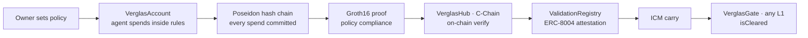

# Verglas

**The trust fabric between Avalanche L1s — agents change chains, their trust travels with them.**

> *verglas (n.) — a thin, clear, hard coating of ice. Clear as glass, hard as ice.*

[](https://github.com/Bekirerdem/verglas/actions/workflows/test.yml)
[](LICENSE)

Avalanche is not one chain; it is a federation of sovereign L1s. An agent that earns trust
on one chain is a stranger on every other. Verglas gives an AI agent a **rule-bound,
non-custodial vault**, proves the agent's spending obeyed the owner's policy with a
**zero-knowledge proof**, records the result as an **ERC-8004 validation attestation**, and
carries that attestation across the federation with **ICM** — so trust earned once is
honored everywhere.

*Kite walls trust in. Verglas lets it travel.*

## How it works



1. **Vault** — the owner deploys a `VerglasAccount` with hard rules: per-tx limit, total
   budget, payee whitelist, kill-switch. The agent spends inside them; it cannot renegotiate.
2. **Receipt** — every spend is folded into an on-chain Poseidon hash chain
   (`c = P(c_prev, P(to, amount))`).
3. **Proof** — the keeper reconstructs the spend window and produces a Groth16 proof
   (~86k constraints): *every spend obeyed the policy — without revealing a single transaction.*
4. **Passport** — `VerglasHub` verifies the proof on C-Chain and writes the attestation to
   the ERC-8004 Validation Registry.
5. **Gate** — any Avalanche L1 runs a `VerglasGate` (ICM receiver). It admits an external
   agent only with a fresh, valid Verglas attestation: **prove once, pass every gate.**

## Contracts

| Contract | Chain | Role |
|---|---|---|
| `VerglasAccount` | any EVM L1 | Non-custodial, rule-bound spend vault (immutable policy, kill-switch) |
| `VerglasFactory` | C-Chain | One-transaction vault deployment |
| `VerglasTreasurer` | C-Chain | FX-aware treasury operator (oracle-guarded USD/TRY payouts) |
| `Groth16Verifier` | C-Chain | On-chain proof verification (~287k gas) |
| `ValidationRegistry` | C-Chain | ERC-8004 Validation Registry (event-compatible deployment) |
| `VerglasHub` | C-Chain | Proof-gated attestation issuer; ICM carry origin |
| `VerglasGate` | any L1 | Three-check ICM receiver; `isCleared(agentId)` border control |
| `VerglasDispenser` | Fuji | Rate-limited test-USDC faucet for workshops |

## Live on Fuji

The full pipeline runs end-to-end on testnet — real spends → proof → attestation → ICM
carry → gate clearance on a second L1 (Dispatch). Addresses:
[`deployments/fuji-testnet.md`](deployments/fuji-testnet.md).

- **Console:** https://verglas.xyz/app
- **Docs:** https://verglas.xyz/docs
- **Landing:** https://verglas.xyz

## Repository layout

| Path | Contents |
|---|---|
| `src/` | Solidity contracts (Foundry) |
| `circuits/` | Circom circuit #1 — policy compliance (N=64 spend window) |
| `keeper/` | Proof & attestation keeper (TypeScript) |
| `sdk/` | `@verglas/sdk` — viem client + browser-safe proving module |
| `web/` | Landing + console (Vite/React → verglas.xyz) |
| `docs/` | VitePress documentation |
| `test/` | Foundry test suite |

## Development

```bash
npm ci        # poseidon-solidity
forge test    # full suite
```

Proving locally additionally requires `circom` 2.x and the pot17 ptau — see
[`docs/proofs.md`](docs/proofs.md).

## Security

- Non-custodial by construction: only the owner can withdraw; the agent can only spend
  inside the policy; rules are immutable after deployment.
- `bindAccount` requires both agent-identity ownership and account ownership (hijack-tested).
- Status: **testnet software, unaudited.** Do not point it at mainnet funds.

## License

[MIT](LICENSE)
